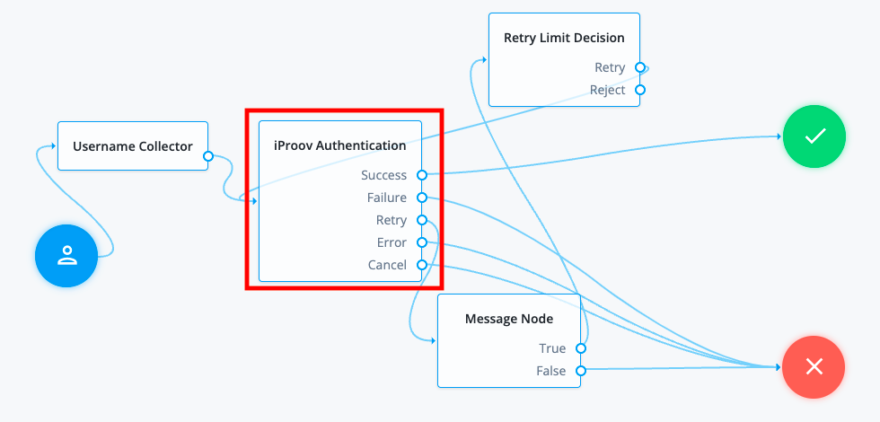

<h1 class="page">iProov Authentication node</h1>

The <strong>iProov Authentication</strong> node integrates the iProov Genuine Presence
Assurance® (GPA) and Liveness Assurance™ (LA) directly from within your
authentication journey on Identity Cloud.

<h2 id="compatibility">Compatibility</h2>

<table class="tableblock frame-all grid-all fit-content">
<colgroup>
<col>
<col>
</colgroup>
<thead>
<tr>
<th class="tableblock halign-left valign-top">Product</th>
<th class="tableblock halign-left valign-top">Compatible?</th>
</tr>
</thead>
<tbody>
<tr>
<td class="tableblock halign-left valign-top">
ForgeRock Identity Cloud
</td>
<td class="tableblock halign-center valign-top">
Yes
</td>
</tr>
<tr>
<td class="tableblock halign-left valign-top">
ForgeRock Access Management (self-managed)
</td>
<td class="tableblock halign-center valign-top">
Yes
</td>
</tr>
<tr>
<td class="tableblock halign-left valign-top">
ForgeRock Identity Platform (self-managed)
</td>
<td class="tableblock halign-center valign-top">
Yes
</td>
</tr>
</tbody>
</table>

## Inputs

A unique username is required in the shared state before the iProov Authentication node executes.

## Dependencies

To use this node, you must configure your iProov tenant. Refer to <a href="auth-node-iproov-setup.html" class="xref page">Setting up the iProov tenant</a>.

## Configuration

The configurable properties for this node are:

<table class="tableblock frame-all grid-all stretch">
<colgroup>
<col style="width: 20%;">
<col style="width: 80%;">
</colgroup>
<thead>
<tr>
<th class="tableblock halign-left valign-top">Property</th>
<th class="tableblock halign-left valign-top">Usage</th>
</tr>
</thead>
<tbody>
<tr>
<td class="tableblock halign-left valign-top">

iProov Tenant

</td>
<td class="tableblock halign-left valign-top">

The hostname of your iProov tenant, either <code>us.rp.secure.iproov.me</code>
or <code>eu.rp.secure.iproov.me</code>.

</td>
</tr>
<tr>
<td class="tableblock halign-left valign-top">

iProov Base URL

</td>
<td class="tableblock halign-left valign-top">

The iProov URL context that contains the version of the REST API, which is
<code>/api/v2</code>.

</td>
</tr>
<tr>
<td class="tableblock halign-left valign-top">

iProov API Key

</td>
<td class="tableblock halign-left valign-top">

The API key you obtained from iProov.

</td>
</tr>
<tr>
<td class="tableblock halign-left valign-top">

iProov API Secret

</td>
<td class="tableblock halign-left valign-top">

The API secret from iProov.

</td>
</tr>
<tr>
<td class="tableblock halign-left valign-top">

iProov OAuth Username

</td>
<td class="tableblock halign-left valign-top">

The username of the OAuth user on iProov.

</td>
</tr>
<tr>
<td class="tableblock halign-left valign-top">

iProov OAuth Password

</td>
<td class="tableblock halign-left valign-top">

The password of the user on iProov.

</td>
</tr>
<tr>
<td class="tableblock halign-left valign-top">

iProov Assurance Type

</td>
<td class="tableblock halign-left valign-top">

The type of API assurance on iProov:

<ul>
<li>

<code>GPA</code>: Generic Presence Assurance

</li>
<li>

<code>LA</code>: Liveness Assurance

Default: <code>GPA</code>.

</li>
</ul>

</td>
</tr>
<tr>
<td class="tableblock halign-left valign-top">

iProov Authentication Type

</td>
<td class="tableblock halign-left valign-top">

The type of authentication. It can be one of:

<ul>
<li>

<code>Enrol</code> - for enrolling the user into iProov.

</li>
<li>

<code>Verify</code> - for verifying the user’s liveness.

</li>
<li>

<code>Combined</code> - for enrollment if the user is not enrolled, otherwise verify
the user’s liveness.

Default: <code>Enrol</code>.

</li>
</ul>

</td>
</tr>
<tr>
<td class="tableblock halign-left valign-top">

User Unique ID Attribute

</td>
<td class="tableblock halign-left valign-top">

The unique ID of the user enrolled with iProov. This attribute must exist in
the user’s AM profile in the identity repository.

</td>
</tr>
<tr>
<td class="tableblock halign-left valign-top">

User Search Attributes

</td>
<td class="tableblock halign-left valign-top">

An alternative attribute that contains the username value, and is used to
search a user in the underlying identity store.

</td>
</tr>
<tr>
<td class="tableblock halign-left valign-top">

ForgeRock UI

</td>
<td class="tableblock halign-left valign-top">

A boolean attribute for determining how the iProovWeb SDK is rendered to the
user.

<ul>
<li>

When set to <code>true</code>, you can view the iProovWebSDK on the Identity Cloud admin UI.

</li>
<li>

When set to <code>false</code>, you can view the iProovWebSDK by going to Native Consoles &gt; Access Management.

Default: <code>true</code>.

</li>
</ul>

</td>
</tr>
<tr>
<td class="tableblock halign-left valign-top">

iProov Version

</td>
<td class="tableblock halign-left valign-top">

The version of the iProov web SDK to use. Now 5.0.0 and 5.0.1 are supported.
Default: 5.0.0.

</td>
</tr>
<tr>
<td class="tableblock halign-left valign-top">

Title Text Color

</td>
<td class="tableblock halign-left valign-top">

Adjusts the color of the title text above the central oval where the image is
captured. By default, no title is used. Refer to the
<a href="#custom-title">Custom Title</a> attribute for more information.

</td>
</tr>
<tr>
<td class="tableblock halign-left valign-top">

Surround Color

</td>
<td class="tableblock halign-left valign-top">

Adjusts the color surrounding the central oval. It also affects the color of
the mask in Liveness Assurance with a <code>clear</code> or <code>blur</code> filter.

</td>
</tr>
<tr>
<td class="tableblock halign-left valign-top">

Prompt Text Color

</td>
<td class="tableblock halign-left valign-top">

Adjusts the color of the text visible in the central prompt of the screen.

</td>
</tr>
<tr>
<td class="tableblock halign-left valign-top">

Prompt Background Color

</td>
<td class="tableblock halign-left valign-top">

Adjusts the color of the background in the central prompt of the screen.

</td>
</tr>
<tr>
<td class="tableblock halign-left valign-top">

Header Background Color

</td>
<td class="tableblock halign-left valign-top">

Adjusts the color of the background in the top bar of the application,
transparent by default.

</td>
</tr>
<tr>
<td class="tableblock halign-left valign-top">

Custom Title

</td>
<td class="tableblock halign-left valign-top">

The title of the camera view that appears above the image area when the camera is capturing the image. Specify a custom title to be shown.
Default: An empty string ("").

</td>
</tr>
<tr>
<td class="tableblock halign-left valign-top">

Assets URL

</td>
<td class="tableblock halign-left valign-top">

Critical dependencies are loaded from the content delivery network (CDN) at
<code>cdn.iproov.app</code>. In a production environment, set this property to your CDN,
for example: https://cdn.iproov.app/myassets.

</td>
</tr>
<tr>
<td class="tableblock halign-left valign-top">

Logo

</td>
<td class="tableblock halign-left valign-top">

A relative link, absolute path or the data URI to your custom logo.
The logo can be in any web format, though it is recommended to use the SVG
format. If you don’t specify a logo, the iProov logo is displayed.
Set to <code>null</code> if you don’t want a logo to be displayed.

</td>
</tr>
<tr>
<td class="tableblock halign-left valign-top">

Network Timeout

</td>
<td class="tableblock halign-left valign-top">

Time in seconds for the backend to acknowledge a message. If the timeout is
exceeded, Identity Cloud returns an error with the feedback code <code>error_network</code>.

Default: 20 (seconds).

</td>
</tr>
<tr>
<td class="tableblock halign-left valign-top">

iProov Camera Filter

</td>
<td class="tableblock halign-left valign-top">

Controls the filter for the camera preview. The value can be classic,
shaded, or vibrant. For Liveness Assurance, two additional filters, clear and blur, are provided. The blur filter is removed when the claim progresses.

+
Default: shaded.

</td>
</tr>
<tr>
<td class="tableblock halign-left valign-top">

Prompt Rounded Corners

</td>
<td class="tableblock halign-left valign-top">

The floating prompt has rounded corners by default. To disable rounded corners, set this attribute to <code>false</code>.

</td>
</tr>
<tr>
<td class="tableblock halign-left valign-top">

Debug

</td>
<td class="tableblock halign-left valign-top">

By default, log messages at level <code>info</code> or lower are hidden. They can be
displayed on the console by setting Debug to <code>true</code>. Log messages at
the <code>warning</code> and <code>error</code> levels are always displayed on the console.

</td>
</tr>
<tr>
<td class="tableblock halign-left valign-top">

Slots

</td>
<td class="tableblock halign-left valign-top">

Customize the markup styling and automatically inherit your application’s
styles by using the Slots attribute.

</td>
</tr>
<tr>
<td class="tableblock halign-left valign-top">

Aria Live

</td>
<td class="tableblock halign-left valign-top">

Control the priority of messages being read out by the screen reader. Refer to
<a href="https://developer.mozilla.org/en-US/docs/Web/Accessibility/ARIA/ARIA_Live_Regions">ARIA live regions</a> in Mozilla documentation for more information on ARIA live.
By default, this is set to <code>assertive</code> to indicate time-sensitive or critical
notifications that require the user’s immediate attention. This can be disabled by setting it to <code>off</code> or <code>polite</code>.

</td>
</tr>
</tbody>
</table>

## Outputs

The following outputs are stored in the shared node state:

<table class="tableblock frame-all grid-all stretch">
<colgroup>
<col style="width: 20%;">
<col style="width: 80%;">
</colgroup>
<thead>
<tr>
<th class="tableblock halign-left valign-top">Output Variable</th>
<th class="tableblock halign-left valign-top">Variable Description</th>
</tr>
</thead>
<tbody>
<tr>
<td class="tableblock halign-left valign-top">

iProovValidateResponse

</td>
<td class="tableblock halign-left valign-top">

The complete validation response from iProov API in JSON format.

</td>
</tr>
<tr>
<td class="tableblock halign-left valign-top">

iProoveValidatePhoto

</td>
<td class="tableblock halign-left valign-top">

Photo from the validated API endpoint response.

</td>
</tr>
</tbody>
</table>

## Outcomes

<dl>
<dt class="hdlist1"><code>Success</code></dt>
<dd>

The iProov verification process is completed successfully.

</dd>
<dt class="hdlist1"><code>Failure</code></dt>
<dd>

The iProov verification process returned a failure because
a user connection or device failed during the verification process.

</dd>
<dt class="hdlist1"><code>Retry</code></dt>
<dd>

The iProov verification process is incomplete due to a failure or user error and can be retried.

</dd>
<dt class="hdlist1"><code>Error</code></dt>
<dd>

A fatal exception occurred due to misconfiguration or an error with the user account. Exceptions are logged at the Error level, and put in the SharedState.

</dd>
<dt class="hdlist1"><code>Cancel</code></dt>
<dd>

The user has opted to cancel the iProov verification.

</dd>
</dl>

## Troubleshooting

If this node logs an error, review the log messages to find the reason for the error and address the issue appropriately.

## Examples

This example journey highlights the use of the <strong>iProov Authentication</strong> node to authenticate by using facial biometrics.

Identity Cloud provides
<a href="https://github.com/ForgeRock/iproov-auth-tree-node/tree/master/sample">sample journeys you can download</a>
to understand and address the most common iProov authentication use cases.
